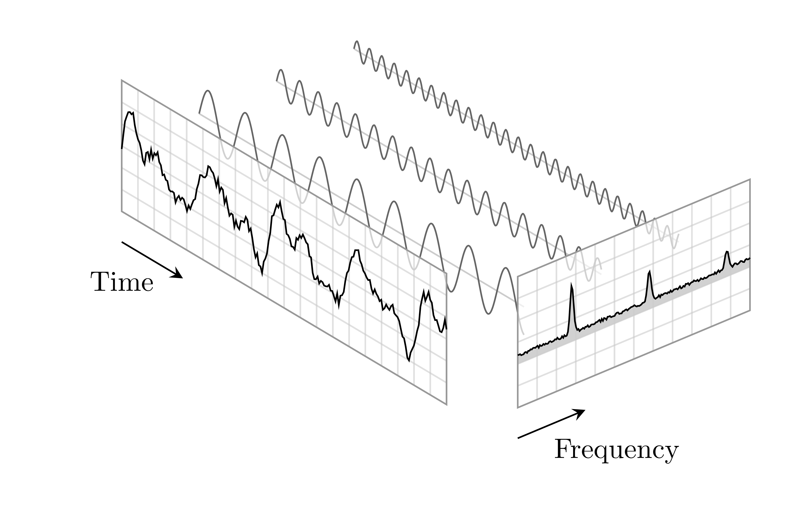

# LaTeX notes
Notes taken in LaTeX in real time during lectures. The repository is organized as follow:
* **`Digital_Signal_Processing`**: folder with lectures notes of the Master degree course "Digital Signal Processing", held by professor Federica Battisti at the University of Padua (Academic Year 2020/2021);
* **`Subnuclear_Physics`**: folder with lectures notes of the Master degree course "Subnuclear Physics", held by professor Donatella Lucchesi at the University of Padua (Academic Year 2019/2020);
* **`snippets.cson`**: file with several snippets in Coffee Script Object Notation, for atom editor environment, useful to maximize the efficiency when writing notes.

 
Links to the complete notes:
* [**Digital Signal Processing**](#https://github.com/RoccoA97/LaTeX_notes/blob/main/Digital_Signal_Processing/main/main.pdf);
* [**Subnuclear Physics**](#https://github.com/RoccoA97/LaTeX_notes/blob/main/Subnuclear_Physics/main/main.pdf).

***
## Lecture Notes of Subnuclear Physics
Lectures notes of the Master degree course "Subnuclear Physics", held by professor Donatella Lucchesi at the University of Padua (Academic Year 2019/2020).

    

### Topics of the course
The topics treated during the course are:
* **introduction and recap**;
* **detectors for particle physics experiments**;
* **cross section of electron-positron scattering to muon-antimuon or to hadrons**;
* **strong interactions**, in particular:
    * deep inelastic scattering;
    * the gluons;
    * QCD theory;
    * partons and jets;
* **electroweak interactions**, in particular:
    * V-A weak theory;
    * gauge theory and symmetry breaking;
    * Cabibbo theory and CKM;
    * CP violation, the B meson system;
* **new physics**, in particular:
    * neutrino and physics beyond Standard Model;
    * Higgs physics and properties.

***
## Lecture Notes of Digital Signal Processing
Lectures notes of the Master degree course "Digital Signal Processing", held by professor Federica Battisti at the University of Padua (Academic Year 2020/2021).

    

### Topics of the course
The topics treated during the course are:
* **introduction and motivations** of the field of Digital Signal Processing;
* **discrete-time signals**;
* **discrete-time systems**;
* **Fourier analysis**, with particular attention to the discete Fourier transform;
* **z-transform**;
* **concepts and techniques for filter design**.
